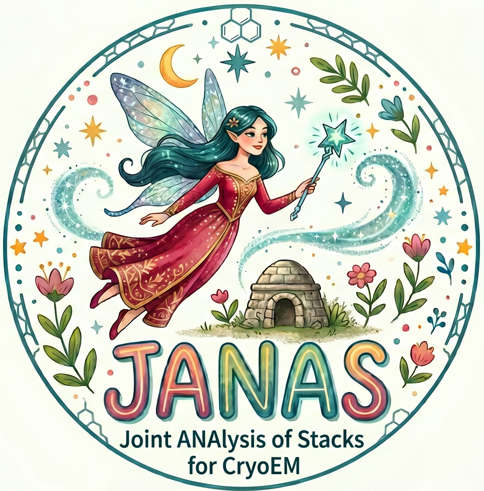

<p align="center">
  
</p>

<h1 align="center">JANAS</h1>
<p align="center"><strong>Joint ANAlysis of Stacks for CryoEM</strong></p>

<p align="center">
  <a href="https://pypi.org/project/janas/"></a>
  <a href="https://pypi.org/project/janas/"></a>
</p>

<p align="center">
  <a href="#installation">Installation</a> &bull;
  <a href="docs/index.md">Documentation</a> &bull;
  <a href="https://github.com/mauromaiorca/janas/issues">Issues</a>
</p>

---

JANAS is a command-line toolkit for particle ranking, subset selection and class reassignment in single-particle cryo-EM workflows.

It uses the per-particle Structural Cross-correlation Index (SCI) to rank particles by their contribution to local map quality.

## Core workflows

| Workflow | Purpose |
|----------|---------|
| [Iterative particle selection](docs/ITERATIVE_SELECTION.md)  | Score, rank and select particle subsets that maximise local resolution. |
| [Custom selected stacks](docs/custom_selected_stacks.md)  | Extract an ad-hoc top-`N` best-ranked subset from a converged selection, e.g. as input for JANAS-based repicking. |
|  [3D class reassignment](docs/CLASS_REASSIGNMENT.md)  | Assign particles to pre-computed classes using per-map SCI scores. |


## Monitoring a running session

JANAS records the outcome of every selection iteration in `overview.txt` and the timing of every individual processing step in `runtime/step_timings.csv`. While the session runs it also keeps an HTML dashboard, `progress.html`, in sync with the latest state. See [Monitoring a running session](docs/progress_dashboard.md) for how to view it locally or over SSH from a remote browser.


## Interoperability workflows

| Workflow | Purpose |
|----------|---------|
| [CryoSPARC particle STAR recovery](docs/workflows/cryosparc_star_recovery.md) | Convert CryoSPARC `.cs` particle metadata to RELION/JANAS STAR format, adjust stack references, and restore original source particle image names after stack-based processing. |

## Accessory utils

| Utility | Purpose |
|---------|---------|
| [sigma_estimate](docs/sigma_estimate.md) | Estimate a Gaussian sigma for SCI scoring from a pair of half-maps. |
| [compare_maps](docs/accessory_utils.md#compare_maps) | Compare two 3D maps using cross-correlation and related similarity measures. |
| [csparc2star-stack](docs/accessory_utils.md#csparc2star-stack) | Convert a CryoSPARC `.cs` file to a RELION STAR and assemble a consolidated `.mrcs` stack. |
| [clip blur](docs/accessory_utils.md#clip-blur) | Gaussian-blur a 3D volume (sigma in Ångström). |
| [clip bfac](docs/accessory_utils.md#clip-bfac) | B-factor weighting (sharpening) of a 3D volume, automatic or user-driven. |
| [fsc](docs/accessory_utils.md#fsc) | Compute Fourier Shell Correlation (FSC) between half-map pairs. |
| [locres](docs/accessory_utils.md#locres) | Compute a local-resolution map from a pair of half-maps. |
| [project_map](docs/accessory_utils.md#project_map) | Project a 3D reference map at each particle pose, writing 2D reprojections. |
| [janas_reconstructor](docs/accessory_utils.md#janas_reconstructor) | Internal 3D reconstruction from scored particles (GPU or CPU). |

## Installation

Requires Python 3.8+, a C++ compiler, and CMake 3.10+.

```bash
pip install janas
```

We recommend installing in an isolated environment:

```bash
python3 -m venv ~/.janas_env
source ~/.janas_env/bin/activate
pip install janas
```

Verify:

```bash
janas --version
```

See the [Installation Guide](docs/installation.md) for conda, pipx, troubleshooting, and building from source.


## Documentation

- [Documentation index](docs/index.md)
- [Installation](docs/installation.md)
- [Quick start](docs/quick-start.md)
- [Iterative particle selection](docs/workflows/selection.md)
- [3D class reassignment](docs/workflows/classification.md)
- [CryoSPARC integration](docs/workflows/cryosparc.md)
- [CLI command reference](docs/reference/cli.md)
- [Accessory utilities](docs/accessory_utils.md)
  - [sigma_estimate](docs/sigma_estimate.md)
- [STAR file operations](docs/reference/star-operations.md)
- [Computational requirements](docs/reference/computational-requirements.md)
- [Tutorial: EMPIAR-10308](docs/examples/empiar-10308.md)
- [Troubleshooting](docs/troubleshooting.md)


## Contact

For questions or issues: mauro.maiorca@cssb-hamburg.de or open an issue on [GitHub](https://github.com/mauromaiorca/janas/issues).
