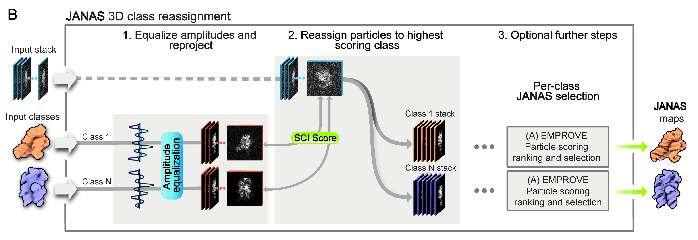

[Repository home](../README.md) · [Installation](installation.md) · [Quick start](quick-start.md) · [CLI reference](reference/cli.md) · [Troubleshooting](troubleshooting.md)

---

# 3D Class reassignment

<p align="center">
  
</p>

3D class reassignment refines particle membership across a set of user-provided reference maps. The input maps usually come from a previous 3D classification step and represent alternative conformational states, but they can also be generated using different masks, refinements, or processing strategies.

JANAS compares each particle with reprojections from every reference map using the Structural Cross-correlation Index (SCI). Each particle is then assigned to the class that best matches its structural signal. This can correct particle misassignment from an initial classification and reduce differences in class quality, especially when classes contain related conformations, minority states, or particles affected by local heterogeneity.

After reassignment, each class can be reconstructed directly or passed to iterative particle selection. This per-class selection step can further improve the coherence of each state before downstream refinement, inspection, or another round of classification.


## Quick start

### Create & Launch the session manager

```bash
janas_session_manager classification_session \
    --name reclassify \
    --particles particles.star \
    --maps class1.mrc class2.mrc class3.mrc \
    --mask mask.mrc \
    --mpi 40 \
    --noExternalPrograms --gpu 0 1

./reclassify/reclassify_run.sh
```

To force a specific CTF handling during scoring, add `--ctf-mode`:

```bash
janas_session_manager classification_session \
    ... \
    --ctf-mode modulate
```

Choices: `phaseflip` (default — applies `sign(CTF)`), `modulate` (multiplies by the full CTF), `wiener` (`CTF / (CTF² + 0.1)`).

## Skipping reconstruction with `--noRecs`

If you want to score and assign particles but reconstruct each class yourself with an external tool (RELION, cryoSPARC, etc.), add `--noRecs`:

```bash
janas_session_manager classification_session \
    --name reclassify \
    --particles particles.star \
    --maps class1.mrc class2.mrc class3.mrc \
    --mask mask.mrc \
    --mpi 40 \
    --noRecs
```

The run script will produce the per-class STAR files in `reclassify/final_classes/` (`class_1.star`, `class_2.star`, ...) but skip reconstruction. You can then reconstruct each class with the software of your choice, for example:

```bash
relion_reconstruct --i class_1.star --o class_1.mrc --ctf
```

Output: `reclassify/final_classes/`

> **Note on `--noExternalPrograms` and `--gpu`:** these flags affect **only the reconstruction and local resolution steps**; particle scoring always runs on CPU (controlled by `--mpi`). GPU acceleration applies only to reconstruction. Choose based on your hardware:
>
> - **With GPU(s) (recommended):** `--noExternalPrograms --gpu 0 1` uses two GPUs, one per half-map, for the best throughput. `--gpu 0` uses a single GPU.
> - **No GPU but RELION available:** omit `--noExternalPrograms` — JANAS will call RELION's MPI-based reconstruction and `relion_postprocess`, which on a CPU-only machine is typically faster than JANAS's internal CPU reconstruction. Make sure RELION is installed and accessible on your `PATH`.
> - **No GPU, no RELION:** `--noExternalPrograms` without `--gpu` runs JANAS's internal CPU reconstruction; it works but is slower on large datasets.
>
> You can also choose to use RELION for reconstruction even when a GPU is available — simply omit `--noExternalPrograms`.

## About `--mpi`

`--mpi` sets the number of parallel worker processes used during particle scoring. The requested value is automatically capped to a safe one at runtime:

1. If `--mpi` is greater than the number of available CPU cores, it is reduced to the CPU count (`multiprocessing.cpu_count()`). For example, requesting `--mpi 50` on a machine with 20 cores will use 20.
2. If `--mpi` is less than 1, it is raised to 1.
3. If `--mpi` is greater than the number of particles being processed, it is reduced to the particle count.

This means you can safely set `--mpi` to a generous value and JANAS will pick the largest reasonable number of workers without over-subscribing the machine. For best performance, set `--mpi` to the number of physical cores you want to dedicate to the run.
