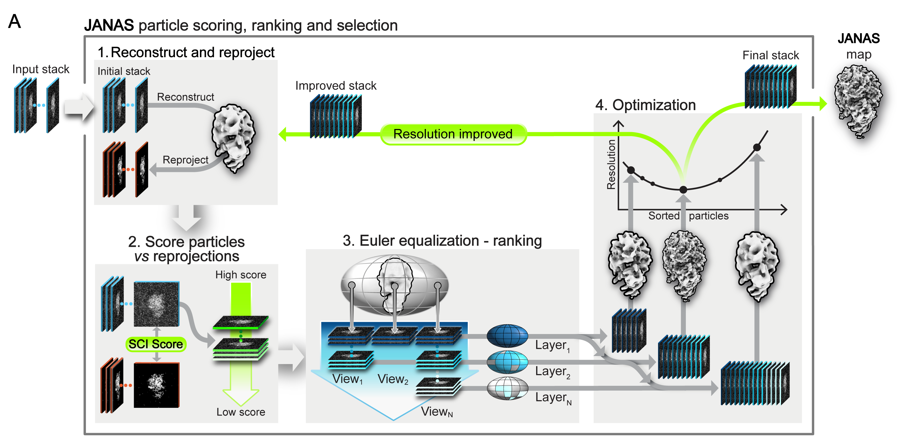

[Repository home](../README.md) · [Installation](installation.md) · [Quick start](quick-start.md) · [CLI reference](reference/cli.md) · [Troubleshooting](troubleshooting.md)

---

# Iterative Selection

<p align="center">
  
</p>

Iterative selection identifies a particle subset that aims to support a more interpretable reconstruction. Starting from an input particle stack (and ideally reference half maps, and mask), JANAS scores particles using the Structural Cross-correlation Index (SCI), ranks them while accounting for angular distribution, and evaluates candidate particle subsets through repeated reconstruction.

Rather than selecting a fixed percentage of particles, JANAS searches for the particle count that gives the most favourable local-resolution behaviour within the masked region. This allows the workflow to retain particles that contribute consistently to the reconstruction while excluding particles that reduce map quality or introduce artefacts.

> 📊 **Watch a run live:** while the script is executing, the session directory always carries an up-to-date HTML dashboard (`progress.html`). See **[Monitoring a running session](progress_dashboard.md)** for how to open it locally or over SSH from a remote browser — it is the recommended way to follow what JANAS is doing.


## Quick start

### Create & Launch the session manager

```bash
janas_session_manager new_select_session \
    --name my_selection \
    --particles particles.star \
    --map halfA.mrc \
    --map2 halfB.mrc \
    --mask mask.mrc \
    --mpi 40 \
    --noExternalPrograms --gpu 0 1

./my_selection/my_selection_run.sh
```

> **Note on `--noExternalPrograms` and `--gpu`:** these flags affect **only the reconstruction and local resolution steps**; particle scoring always runs on CPU (controlled by `--mpi`). GPU acceleration applies only to reconstruction. Choose based on your hardware:
>
> - **With GPU(s) (recommended):** `--noExternalPrograms --gpu 0 1` uses two GPUs, one per half-map, for the best throughput. `--gpu 0` uses a single GPU.
> - **No GPU but RELION available:** omit `--noExternalPrograms` — JANAS will call RELION's MPI-based reconstruction and `relion_postprocess`, which on a CPU-only machine is typically faster than JANAS's internal CPU reconstruction. Make sure RELION is installed and accessible on your `PATH`.
> - **No GPU, no RELION:** `--noExternalPrograms` without `--gpu` runs JANAS's internal CPU reconstruction; it works but is slower on large datasets.
>
> You can also choose to use RELION for reconstruction even when a GPU is available — simply omit `--noExternalPrograms`.

## About `--mpi`

`--mpi` sets the number of parallel worker processes used during particle scoring. The requested value is automatically capped to a safe one at runtime:

1. If `--mpi` is greater than the number of available CPU cores, it is reduced to the CPU count (`multiprocessing.cpu_count()`). For example, requesting `--mpi 50` on a machine with 20 cores will use 20.
2. If `--mpi` is less than 1, it is raised to 1.
3. If `--mpi` is greater than the number of particles being processed, it is reduced to the particle count.

This means you can safely set `--mpi` to a generous value and JANAS will pick the largest reasonable number of workers without over-subscribing the machine. For best performance, set `--mpi` to the number of physical cores you want to dedicate to the run.

---

## Advanced example

A typical command using most of the available options — including
`--autoSigma`, which JANAS can use **from the very first selection** as
long as `--map` and `--map2` are independent half-maps (or `--bootstrap`
is set, which generates an independent pair on the fly):

```bash
janas_session_manager new_select_session \
    --name janas_selection_adptiveMaskRound01 \
    --particles J606_004_particlesStack.star \
    --map J606_004_particlesStack_recH1.mrc \
    --map2 J606_004_particlesStack_recH2.mrc \
    --mask maskFinal/mask_AB_dilated2.mrc \
    --assessMask maskFinal/E12707_assessmentMask_AB.mrc \
    --preGaussianBlur 1 \
    --bootstrap \
    --angpix 0.9540 \
    --autoSigma \
    --maxSelections 15 \
    --numRecs 10 \
    --numViews 350 \
    --mpi 80 \
    --gpu 0 1 \
    --noExternalPrograms \
    --adaptive_mask
```

If you would rather pin sigma explicitly (e.g. for a controlled
comparison across runs), replace `--autoSigma` with `--sigma 1`.

A subsequent round naturally reuses the half-maps of the previous round
as the new `--map` / `--map2`:

```bash
janas_session_manager new_select_session \
    --name janas_selection_adptiveMaskRound02b \
    --particles janas_selection_adptiveMaskRound01/refine_LR/particles_0004.star \
    --map  janas_selection_adptiveMaskRound01/refine_LR/J899_004_volume_map_half_A.mrc \
    --map2 janas_selection_adptiveMaskRound01/refine_LR/J899_004_volume_map_half_B.mrc \
    --mask maskFinal/mask_AB_dilated2.mrc \
    --assessMask maskFinal/E12707_assessmentMask_AB.mrc \
    --preGaussianBlur 1 \
    --bootstrap \
    --angpix 0.9540 \
    --autoSigma \
    --maxSelections 15 \
    --numRecs 10 \
    --numViews 350 \
    --mpi 70 \
    --gpu 0 1 \
    --noExternalPrograms \
    --adaptive_mask
```

### Highlights of the advanced workflow

A few things in the command above are worth calling out explicitly,
because they change the behaviour of the selection in non-obvious ways.

#### Use `--assessMask` to focus the optimiser — but only on densities you trust

`--assessMask` separates the **scoring region** (`--mask`, used during
SCI) from the **assessment region** (where local resolution is
measured to decide which subset is best). This lets you score against a
broad mask covering the full particle while optimising the selection
for the local resolution of a specific functional region.

This is a very powerful lever, and it is exactly the reason it has to
be used carefully. As discussed in the
[JANAS manuscript](citation.md), the optimiser will
**chase any signal that increases local resolution inside the assess
mask** — including artefacts inherited from earlier processing steps.
A good `--assessMask` should therefore enclose **only densities you are
confident about**:

- Avoid regions with obvious overfitting bumps, streaks, or other
  reconstruction artefacts (e.g. from an over-aggressive angular
  refinement upstream).
- Avoid solvent / disordered regions and box edges.
- Prefer well-resolved, structurally meaningful densities — even if
  that means making the mask small.

The same caveat applies, to a lesser extent, to `--mask`, but
`--assessMask` is what the optimiser ultimately reads as "ground truth",
so it is the one that benefits the most from a conservative definition.

#### `--adaptive_mask`: the same caveat, amplified

`--adaptive_mask` builds the assessment mask **dynamically** at every
iteration, by carving out the highest-resolution voxels inside
`--assessMask` (or `--mask` if no `--assessMask` is given). This is
extremely effective at locking onto the well-resolved parts of the map,
but it also **amplifies every problem of the parent mask**: if
`--assessMask` includes an overfit hotspot, the adaptive mask will
shrink onto it and the optimiser will happily race towards a fictitious
high-resolution score.

Rule of thumb: when you enable `--adaptive_mask`, audit the
`--assessMask` (or `--mask`) you are feeding it more strictly than you
would otherwise. The combination is the most powerful tool JANAS
exposes and, by the same token, the easiest one to misuse.

#### `--aggressive`: trade thoroughness for wall-clock time

`--aggressive` makes the optimiser update the target particles from the
current overview selection at every iteration, rather than waiting for
the usual stability checks. The selection converges in fewer
iterations and the run wall-clock goes down noticeably, at the cost of
slightly less robustness against transient regressions.

Use it when you need to wrap up a session quickly — for example when
you are iterating on parameters, or when you want to launch a JANAS-
based repicking pass (see
[custom selected stacks](custom_selected_stacks.md)) before the end of
the working day. For final, publication-grade selections, leaving
`--aggressive` off is the safer default.

#### Following the run

Every option above changes what the optimiser does at every iteration —
the best way to confirm that the run is doing what you expect is to
open `progress.html` and watch the *Current stage*, the per-iteration
overview and the live Euler-angle histograms. See
[Monitoring a running session](progress_dashboard.md).

---

## Parameters reference

The arguments are grouped as in `janas_session_manager new_select_session --help`. Only the most frequently used options are listed here; run the command with `--help` for the full list including expert-level tuning parameters.

### Core inputs

| Flag | Required | Description |
|---|---|---|
| `--name` | yes | Name of the new session. Creates a directory and a TOML settings file inside it. |
| `--particles` | yes | STAR file with the list of particles. |
| `--map` | yes | First reference (a full reconstruction, or the first half-map of a pair). |
| `--map2` | no | Second half-map. Required for any workflow that needs an independent half-map pair (gold-standard FSC, auto-sigma, bootstrap). |
| `--angpix` | no | Pixel spacing in Å/pixel. If omitted, it is inferred from `--map`. |

### Masks

| Flag | Required | Description |
|---|---|---|
| `--mask` | yes | Main 3D mask used during particle scoring (defines the region of interest). |
| `--assessMask` | no | MRC mask used **only** for the local-resolution assessment that drives the selection. If omitted, the main `--mask` is used. Useful when you want to score against a broad mask but optimise local resolution within a tighter region (for example, a single domain). |
| `--adaptive_mask` | no | Build an adaptive assessment mask from `partialLocres.mrc` and use it for the final `locresStats` evaluation of each selection. The adaptive mask is recomputed every iteration as the reconstruction improves. |
| `--adaptive_mask_locres_blur` | no | Gaussian sigma (default `1.0`) used by `janas_utils split_mask` when deriving the adaptive assessment mask. |
| `--adaptive_mask_independent` | no | Force the current iteration to use an independent adaptive mask without merging it with the target adaptive mask. Implies `--adaptive_mask`. |
| `--subtractionMask` | no | Optional 3D MRC mask defining the region to subtract during scoring (map-based signal subtraction). |

### Scoring and assessment

| Flag | Default | Description |
|---|---|---|
| `--sigma` | `1.0` | Gaussian sigma (in pixels) used by SCI scoring. Larger values smooth out high-frequency noise; smaller values emphasise fine structure. See [sigma_estimate](sigma_estimate.md) for the full theory. |
| `--preGaussianBlur` | `0.0` | Gaussian blur applied to the input map(s) **before** scoring (sigma in Å). Use `0` (the default) to disable. A small blur (e.g. `1`) reduces sensitivity to high-frequency reconstruction artefacts when scoring against unsharpened half-maps. |
| `--ctf-mode` | `phaseflip` | CTF application mode for particle scoring: `modulate` (multiply by the full CTF), `phaseflip` (sign of CTF), or `wiener` (`CTF / (CTF² + 0.1)`). |
| `--postprocessing` | `avg` | Post-processing mode used when combining half-maps: `avg` or `autobfac`. |
| `--resolutionBestTarget` | `meanResolution` | Resolution statistic to optimise. One of `meanResolution`, `highResolution`, `highresolutionquartile`, `lowResolution`, `lowresolutionquartile`. |
| `--assessmentMethod` | `mean` | Statistic used for local-resolution assessment: `mean` or `median`. |
| `--maskingCrop` | off | Crop to the mask to accelerate local-resolution computation. |

### Auto-sigma

`--sigma` can be specified explicitly, or estimated automatically from the FSC between two half-maps (see [sigma_estimate](sigma_estimate.md)).

| Flag | Description |
|---|---|
| `--autoSigma` | Estimate `--sigma` automatically. Requires either `--map` + `--map2` pointing to two **different** half-map files, or `--bootstrap` (which generates an independent half-map pair on the fly), or `--autoSigmaInitialHalfMaps`. |
| `--autoSigmaInitialHalfMaps HALFM1 HALFM2` | Optional half-map pair used **only** for the initial auto-sigma estimate. If omitted, `--map` and `--map2` are used. Useful when the maps passed via `--map`/`--map2` are coupled (e.g. derived from the same reconstruction) and you want to seed the sigma estimate from an independent pair. |
| `--autoSigmaMask MASK` | Optional mask used **only** for the auto-sigma estimation. Use `none` (or omit) to compute sigma without a mask. |

### Iteration and optimisation

| Flag | Default | Description |
|---|---|---|
| `--bootstrap` | off | Randomise the half-map assignments at each iteration. Recommended when running with `--autoSigma` against a single combined map, and useful in general for robustness. |
| `--maxSelections` | `8` | Maximum number of selection iterations. Early termination kicks in if no improvement is observed for several consecutive iterations. |
| `--numRecs` | `10` | Number of sampling reconstructions per selection iteration. More samples explore the particle-count axis more finely but cost roughly proportionally more reconstructions. |
| `--numViews` | `350` | Number of Euler views used to partition the orientation sphere when ranking particles by SCI. Increase (e.g. to `1500`) for very large datasets with uniform angular coverage; decrease (e.g. to `100`) for small or strongly oriented datasets. Going below ~50 is discouraged. |
| `--aggressive` | off | Aggressively update the target particles from the current overview selection at each iteration. |
| `--samplingDensityFactor` | `0.5` | Sampling density factor for reconstruction sampling. |
| `--extraSamples_num` | `5` | Number of extra reconstruction samples used to escape local minima. |

### Runtime and backend

| Flag | Default | Description |
|---|---|---|
| `--mpi` | `5` | Number of CPU worker processes for particle scoring. Auto-capped to `cpu_count()` and to the particle count (see [About `--mpi`](#about--mpi)). |
| `--gpu I [J ...]` | `[]` (CPU-only) | GPU indices for the internal reconstructor, for example `--gpu 0 1`. Affects only reconstruction and local resolution when used together with `--noExternalPrograms`. |
| `--noExternalPrograms` | off | Generate a self-contained run script that avoids external software (RELION for reconstruction and local resolution). |
| `--particleSubtraction` | off | Declare that the input stack comes from particle subtraction. The STAR file should then contain a backup field linking to the unsubtracted particles. |
