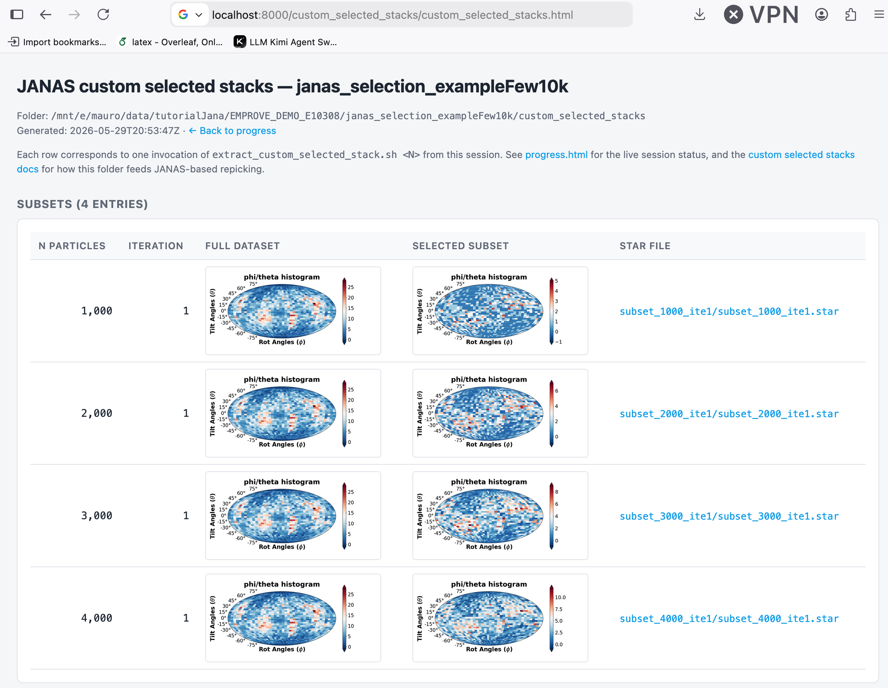

# Custom selected stacks (ad-hoc subsets for JANAS-based repicking)

JANAS records the per-particle ranking of every selection iteration in the
`scored_selection_<ite>.star` file inside each iteration directory. The
**custom selected stacks** feature exposes that ranking so you can extract
an arbitrary top-`N` subset of the best-ranked particles outside the
optimiser loop — most commonly to feed a **JANAS-based repicking** stage.

This is the same mechanism described in the *JANAS-based repicking* section
of the JANAS manuscript: once a selection has converged on a set of
high-quality particles, the best-ranked subset is used as the input pool
for a repicking pass (template matching or 2D-class-driven repicking on the
raw micrographs), so that the next round of refinement starts from a
cleaner, denser sampling of the truly informative views.

## When to use it

You should only run the extractor **after** you have a meaningful particle
selection. The recommended workflow is:

1. **Run a JANAS particle selection.** Drive at least a few iterations of
   `Iterative particle selection` so that
   `_janas_target_selection` settles on a high-quality iteration.
2. **Identify the best iteration.** This is the iteration currently flagged
   as `_janas_target_selection` in `overview.txt` — also the one whose
   metrics are shown as the *current selection* in `progress.html`.
3. **Decide how many particles you want.** Pick `N` based on what the
   downstream repicking / refinement step needs (e.g. the same count as the
   current best subset, or a smaller, tighter set).
4. **Run the extractor** (see below).
5. **Feed the resulting STAR file** into your repicking pipeline.

Skipping step 1 is not meaningful: without scoring, the
`scored_selection_<ite>.star` files do not exist and there is no
per-particle ranking to draw from.

## What the extractor does

When the session manager generates the run script, it also writes a
self-contained shell script

```
<session_dir>/<iteration_tag>/extract_custom_selected_stack.sh
```

into **every** iteration directory. The script knows its own iteration
number and sigma tag — it has no global state to look up.

Whenever an iteration becomes the new `_janas_target_selection`, JANAS
also copies that iteration's script to the session root:

```
<session_dir>/extract_custom_selected_stack.sh
```

so the "current best" extractor is always one click away. If a later
iteration becomes the new target, the script at the session root is
overwritten with that iteration's version (older copies remain in their
respective iteration directories).

## Running the script

```bash
cd <session_dir>
./extract_custom_selected_stack.sh <N>
```

where `<N>` is the number of best-ranked particles to extract. `N` is
**mandatory** — there is no default. The script uses
`janas selectBestRanked --exact`, so if the source STAR contains fewer
than `N` particles the command exits with a non-zero status and an
explicit error message instead of silently returning whatever is
available.

You can also run the extractor from any iteration directory; it always
resolves the session root from its own location.

## Output layout

Each invocation writes a self-contained subdirectory:

```
<session_dir>/custom_selected_stacks/
└── subset_<N>_ite<ITE>/
    ├── subset_<N>_ite<ITE>.star            # top-N best-ranked particles
    ├── subset_<N>_ite<ITE>_eulerhist.png   # Euler-angle distribution
    └── subset_<N>_ite<ITE>_manifest.txt    # provenance (N, iteration, source, timestamp)
```

One subdirectory per `(N, iteration)` pair. Re-running with the same `N`
on the same iteration overwrites the contents of that subdirectory
silently — it is safe to iterate on a value of `N` without manual
cleanup.

The Euler-angle histogram is always rendered with
`janas eulerHist --fontScale 2.0`, so it is legible directly in the
manuscript figures or in `progress.html`.

## How to use the output for repicking

The extracted `subset_<N>_ite<ITE>.star` file is a regular RELION-style
STAR file containing the same metadata as the source, restricted to the
top-`N` best-ranked particles. From there:

- Use it as the **input particle set** for your repicker (e.g. template
  matching, Topaz, 2D-class-driven repicking) when you want to bias the
  templates / models toward the views that JANAS has identified as
  informative.
- Use it as the **reference set** when you want to compare the local
  resolution achievable with a tighter selection against the JANAS
  optimum.
- Compare the Euler distribution PNG against the histogram of the full
  session to confirm that the subset is not pathologically anisotropic
  before launching expensive repicking jobs.

## Browsing extracted subsets — `custom_selected_stacks/custom_selected_stacks.html`

Alongside the per-subset folders, JANAS keeps a small companion page at

```
<session_dir>/custom_selected_stacks/custom_selected_stacks.html
```

<p align="center">
  
</p>

with one row per extracted subset, showing:

- **N particles** — the value of `N` passed to the extractor.
- **Iteration** — the JANAS iteration the subset was drawn from.
- **Full dataset** — the Euler-angle distribution of the input STAR
  (the same histogram shown at the top of `progress.html`), for context.
- **Selected subset** — the Euler-angle distribution of the extracted
  subset.
- **STAR file** — a direct link to the STAR file ready to be fed into
  the repicker.

The page is created at session setup (with an empty table and a link
back to `progress.html`) so it is always reachable from the dashboard,
even before any subset has been produced. It is then refreshed every
time `progress.html` is refreshed *and* every time you run
`./extract_custom_selected_stack.sh <N>` — the extractor invokes
`janas_optimizer progress --quiet` after writing the subset, so the new
row appears in the dashboard without any manual step.

`progress.html` contains a direct link to
`custom_selected_stacks/custom_selected_stacks.html` inside the
**Current stage** card, right below the *Started / Elapsed* line, so it
is always one click away while the session is running.

## Related

- [Iterative particle selection](ITERATIVE_SELECTION.md) — how to obtain
  the scored selection files that this extractor consumes.
- [Monitoring a running session](progress_dashboard.md) — the *current
  selection* card in `progress.html` shows which iteration the
  session-root extractor currently points at, and the
  *Custom selected stacks* header link opens the companion index page.
