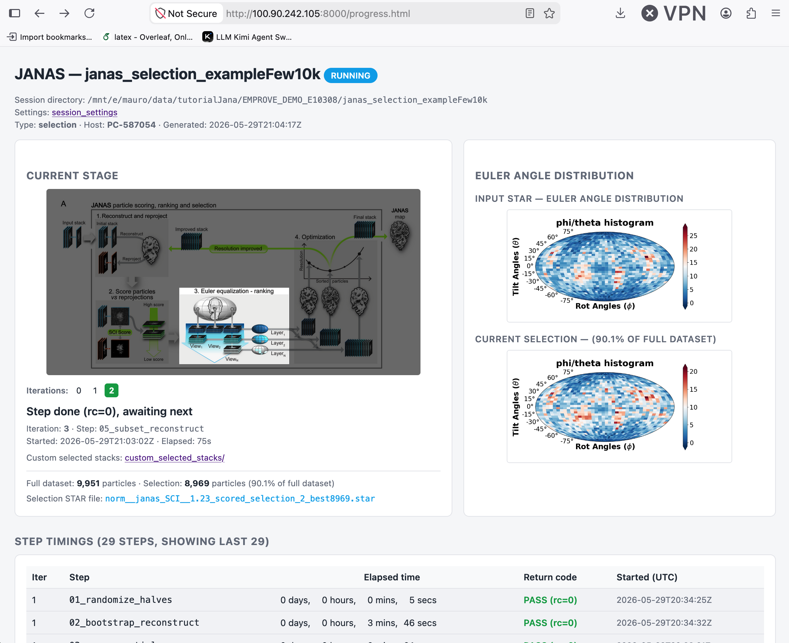

[Repository home](../README.md) · [Docs home](index.md) · [Iterative particle selection](ITERATIVE_SELECTION.md) · [3D class reassignment](CLASS_REASSIGNMENT.md) · [Troubleshooting](troubleshooting.md)

---

# Monitoring a running session

JANAS makes the state of a running session inspectable without attaching to the shell that launched it. While the run script executes, the session directory accumulates a small set of well-defined artefacts, and an HTML dashboard, `progress.html`, is regenerated after every state change so it always reflects the latest available information.

This page describes:

1. what JANAS records during a session,
2. what `progress.html` shows,
3. where these files live,
4. when the dashboard is refreshed,
5. how to view it locally,
6. how to view it remotely over SSH,
7. the CLI options of `janas_optimizer progress`,
8. and the most common troubleshooting cases.

---

## 1. What JANAS records during a session

JANAS exposes session progress at two different granularities, with two further artefacts that carry the raw event stream and a human-readable snapshot.

| Granularity | File | Contents |
|---|---|---|
| **Per selection iteration** | `overview.txt` | One row per iteration of the selection loop: sigma, particle count, mean / median / quantile / min / max local resolution, best subset, etc. This is what the selection algorithm reads back to decide how to optimise. |
| **Per processing step** | `runtime/step_timings.csv` | One row per shell step executed inside an iteration (`01_randomize_halves`, `02_bootstrap_reconstruct`, `03_score_particles`, `04_subsets`, `05_subset_reconstructions`, `06_locres`, `07_locres_stats`, `08_get_num_particles`, …). Each row carries `iteration`, `step`, `t_start`, `t_end`, `elapsed_s`, `rc`. |
| Raw event stream | `runtime/events.ndjson` | Append-only NDJSON. One record per `session_start` / `step_start` / `step_end` / `session_end`, including iteration, step, status, return code, log path, host and (where present) SLURM job id, nodes, CPUs and `CUDA_VISIBLE_DEVICES`. |
| Current snapshot | `runtime/status.txt` | Overwritten on every state change. Human-readable block with the current iteration, step, status, log path and timestamps. Designed to be `cat`-friendly. |

A single selection iteration normally contains several processing steps, so each row of `overview.txt` is the consolidation of many rows of `step_timings.csv`. The two files are intentionally complementary: `overview.txt` is the scientific record, `step_timings.csv` is the engineering record.

---

## 2. The `progress.html` dashboard

The dashboard is a single self-contained HTML page that consumes the four artefacts above. It has no external assets and uses no JavaScript, so it works from `file://` on any browser and offline.

<p align="center">
  
</p>

It renders five sections:

- **Current stage** — a card with one of six bundled illustrations (`selection_unstarted.png`, `selection_step1.png` … `selection_step4.png`, `selection_finished.png`), picked from the most recent event. The current iteration, step name, time the step started and elapsed seconds are shown beneath the image. For `classification_session` the page is text-only (no stage illustration).
- **Host** — the hostname where the run script is executing, surfaced in the header line of the page. JANAS does not currently integrate with the cluster scheduler, so SLURM job ids, node lists and CPU counts are not rendered (they are still captured in `events.ndjson` for downstream tooling).
- **Step timings** — last 50 rows of `step_timings.csv`. Adjacent iterations are visually banded (odd / even row backgrounds), the return-code column reads `PASS (rc=0)` in green and `FAIL (rc=N)` in red.
- **Iteration overview** — the contents of `overview.txt` rendered verbatim in a fixed-pitch block.
- **Recent events** — the last N records of `events.ndjson` (default 100), one per line.

A companion page, **`settings.html`**, is generated next to `progress.html` from `session_settings.toml`. The progress header links to it as `Settings: session_settings`. It is a one-shot render (the settings file does not change during a run) and contains a key/value table plus the raw TOML for copy-paste. When `session_settings.toml` exists but `settings.html` has not been generated yet, the header link falls back to the raw `.toml` so the user always has something clickable.

An `<meta http-equiv="refresh" content="15">` is embedded by default, so any browser open on the page reloads itself every 15 s. The meta tag is automatically dropped once the session has been marked `finished` (no further updates can arrive), so the page stops reloading on its own at the end of the run.

---

## 3. Where these files live

Everything sits under the **session working directory**, the same directory created by `janas_session_manager` (`--name <session>` → `./<session>/`):

```
<session>/
├── progress.html                    ← the dashboard
├── overview.txt                     ← per-iteration scientific record
├── session_settings.toml            ← (selection) or
├── session_classification_settings.txt  (classification)
├── <session>_run.sh
└── runtime/
    ├── status.txt                   ← current snapshot
    ├── events.ndjson                ← append-only event stream
    ├── step_timings.csv             ← per-step timings
    └── imgs/                        ← stage illustrations
        ├── selection_unstarted.png
        ├── selection_step1.png
        ├── selection_step2.png
        ├── selection_step3.png
        ├── selection_step4.png
        └── selection_finished.png
```

The stage illustrations are copied once from the installed package the first time `progress.html` is written. They are static; you do not need to refresh them.

---

## 4. When the dashboard is refreshed

The run script generated by `janas_session_manager` invokes `janas_optimizer progress --quiet` automatically at every hook in the runtime-logging block:

- end of `init_runtime_logging` (after the `session_start` event is written);
- end of every `run_step` (after the `step_end` event and the `step_timings.csv` row are on disk);
- end of `finish_runtime_logging` (after the `session_end` event with status `finished`);
- end of the EXIT trap (after the `session_end` event with status `aborted`).

Each invocation is wrapped with `|| true` and redirected to `/dev/null`, so a failure in the dashboard generator can never abort the scientific run.

You can also regenerate the page manually at any time:

```bash
janas_optimizer progress --session /path/to/<session>
```

A manual call is the only way to refresh the dashboard for a `classification_session`, because the classification run script does not yet wire the runtime-logging hooks.

---

## 5. Viewing the dashboard locally

On a workstation with a browser installed, open the file directly:

```bash
# macOS
open <session>/progress.html

# Linux desktop
xdg-open <session>/progress.html

# WSL (opens the page in the Windows host's default browser)
explorer.exe <session>/progress.html
```

The page auto-refreshes itself every 15 s, so simply leave the tab open while the run script is executing.

---

## 6. Viewing the dashboard remotely over SSH

The recommended approach combines SSH local port forwarding with the standard-library HTTP server. Nothing is installed on either side beyond `python3` (already required by JANAS) and the SSH client.

### 6.1 Single-host case (workstation or login node)

From the laptop:

```bash
ssh -L 8000:localhost:8000 user@server-janas \
    "cd /path/to/<session> && python3 -m http.server 8000 2>/dev/null"
```

What this does:

- `-L 8000:localhost:8000` forwards local port 8000 to port 8000 on the server, bound to its `localhost` interface (never exposed to the network).
- The remote command launches a small HTTP server that serves the session directory.
- The `2>/dev/null` suppresses the per-request access log.

Then open `http://localhost:8000/progress.html` in the local browser. The `<meta refresh>` does the rest.

When you no longer need the dashboard, press `Ctrl+C` in the SSH session and everything stops. No daemon, no residual files.

### 6.2 Cluster case (Slurm / PBS compute node)

If the run script executes on a compute node (`computeNN`) rather than the login node, configure a `ProxyJump` once in your local `~/.ssh/config`:

```
Host computeNN-via-login
  HostName computeNN
  ProxyJump user@login.cluster
```

Then:

```bash
ssh -L 8000:localhost:8000 computeNN-via-login \
    "cd /path/to/<session> && python3 -m http.server 8000 2>/dev/null"
```

The forward chain (laptop → login node → compute node) is transparent.

### 6.3 Alternative: `sshfs`

When you also want to browse the per-step logs and other artefacts of the session, mounting the remote tree with `sshfs` is often more convenient than a one-off HTTP server:

```bash
# install once (macOS: brew install macfuse sshfs; Linux: apt install sshfs)
mkdir -p ~/janas_remote
sshfs user@server-janas:/path/to/<session> ~/janas_remote
open ~/janas_remote/progress.html   # macOS; xdg-open on Linux
```

Trade-offs:

- **For**: file:// works, auto-refresh works, you can also click through to per-step logs and PNGs side by side.
- **Against**: requires FUSE on the client (`macFUSE` on macOS asks for kernel-extension consent on first install). The SSH connection must stay up; if it drops, the mount disappears.

---

## 7. CLI reference

```bash
janas_optimizer progress [--session DIR | --overview FILE]
                         [--refresh SECONDS]
                         [--max-events N]
                         [--quiet]
```

| Flag | Default | Description |
|---|---|---|
| `--session DIR` | `.` | Session directory (the one containing `overview.txt` and `runtime/`). |
| `--overview FILE` | — | Alternative to `--session`: pass the path to `overview.txt`; the session directory is inferred from its parent. |
| `--refresh SECONDS` | `15` | Seconds for the embedded `<meta http-equiv="refresh">`. Pass `0` to disable auto-refresh. The tag is also dropped automatically once the session has been marked `finished`. |
| `--max-events N` | `100` | Maximum number of records rendered in the "Recent events" section. |
| `--quiet` | off | Suppress the `Wrote <path>` line on success. Used by the runtime-logging shell hooks. |

For a `classification_session` the same command works and produces a text-only page (no stage illustration, no `runtime/imgs/` copy).

---

## 8. Troubleshooting

**The browser shows broken image icons.** The relative paths in `progress.html` point to `runtime/imgs/*.png`. The HTTP server must therefore be started from the **session directory itself**, not from a parent. If you `cd` one level up and run `python -m http.server`, the images do not resolve.

**`OSError: [Errno 48] Address already in use`.** Port 8000 is occupied. Use any free port: `ssh -L 8123:localhost:8123 ... python3 -m http.server 8123` and visit `http://localhost:8123/progress.html`.

**The stage image is stuck on `selection_unstarted.png`.** Make sure JANAS is `>= 2.1.1` (the run script also needs to have been regenerated under that version). Earlier releases kept the unstarted picture once the session was actually running.

**The dashboard has not moved for several minutes.** Inspect `runtime/status.txt` directly: the "Updated" timestamp shows when the run script last fired a hook. If it is recent, the current step is simply long-running (typical for `06_locres` / `07_locres_stats` on large boxes). If it is stale, the run script may have crashed without reaching the EXIT trap; check the per-step log under `<session>/<tag>/steps/<NN>_<step>.log`.

**Classification session: `progress.html` is text-only.** This is expected. The classification workflow does not (yet) ship stage illustrations, and its run script does not call the runtime-logging hooks automatically. Run `janas_optimizer progress --session <session>` manually to refresh the page.

---

[Back to documentation index](index.md)
