# DEMO on the Serotonin 5-HT1B–Go receptor complex (EMPIAR-10308)
> class reassignment and particle selection to elucidate low-populated conformational states

## data preparation
Download the data from the EMPIAR server:
```
mkdir -p Particles
lftp ftp://ftp.ebi.ac.uk <<EOF
  mirror --verbose /empiar/world_availability/10308/data/Particles Particles
  quit
EOF
```

Also, you would need to retrieve the necessary files to start with, which can be downloaded [here](https://syncandshare.desy.de/index.php/s/7YdCeNegBi5zcW9), and placed in the main directory, and include three maps:


| Reference 1 (full Map)                             | Reference 2 (low-populated class)                            |     Mask                       |
|:--------------------------------------:|:--------------------------------------:|:--------------------------------------:|
| 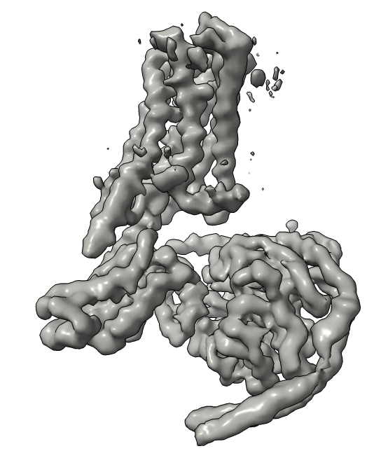 | 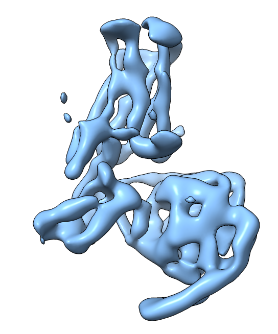 | 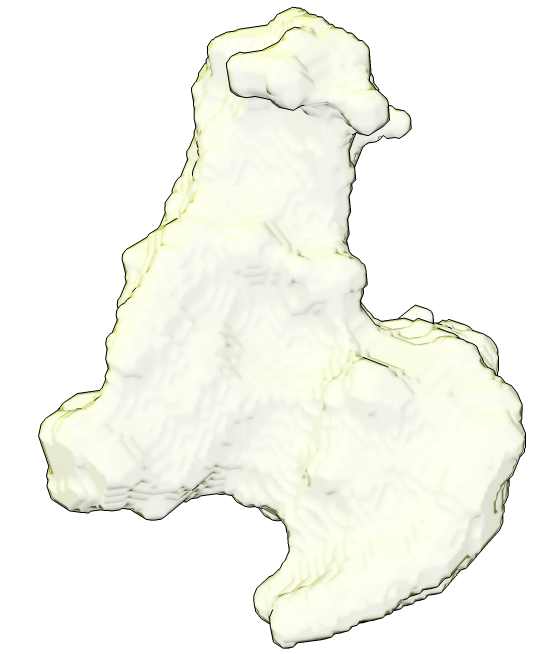 |   
| 244,565 Particles  | 14,641 Particles  | Mask |
| Filename: reference_Refined_rec.mrc   | Filename: J958_003_volume_mapAligned.mrc  | Filename: maskFull_dilatedClose.mrc  | 
|Reference map obtained from 244K particles refined (as per Fig. 3 of the JANAS manuscript) |Reference map obtained from cryoSPARC 3D class reassigment, followed by 3D-NU Refinement|mask enclosing all the densities, produced with the aid of relion_mask_create|

and a star file `reference_Refined_notationEMPIAR.star`, from which you can produce a single full stack with only the relevant particles, using the relion command:

```
relion_stack_create --i reference_Refined_notationEMPIAR.star --o reference_Refined_stack --one_by_one
```

which produces as output a `reference_Refined_stack.star` and `reference_Refined_stack.mrcs`.

## 3D Class Reassignment

In this section you will perform JANAS’s 3D class reassignment using two reference volumes: 
the full-dataset reconstruction and a low-abundance class focused on the donitriptan-binding pocket. 
JANAS scores each particle against amplitude-equalised reprojections of both maps, then assigns it to whichever 
map yields the higher Structural Cross-correlation Index. 
This targeted reassignment enriches the low-populated state while preserving particles that 
support the global map. Although we use two classes here for clarity, 
you may supply any number of experimentally derived maps (for example, additional cryoSPARC classes) 
to capture more complex heterogeneity.

First, initialize the JANAS session with `janas_session_manager classification_session`:

```
janas_session_manager classification_session \
            --name demo_JANAS_0.1.3 \
            --particles reference_Refined_stack.star  \
            --maps reference_Refined_rec.mrc J958_003_volume_mapAligned.mrc \
            --mask maskFull_dilatedClose.mrc \
            --mpi 85 \
            --noExternalPrograms --gpu 0 1
```

> **Note on `--noExternalPrograms` and `--gpu`:** these flags affect **only the reconstruction and local resolution steps**; particle scoring always runs on CPU (controlled by `--mpi`). GPU acceleration applies only to reconstruction. Choose based on your hardware:
>
> - **With GPU(s) (recommended):** `--noExternalPrograms --gpu 0 1` uses two GPUs, one per half-map, for the best throughput. `--gpu 0` uses a single GPU.
> - **No GPU but RELION available:** omit `--noExternalPrograms` — JANAS will call RELION's MPI-based reconstruction and `relion_postprocess`, which on a CPU-only machine is typically faster than JANAS's internal CPU reconstruction. Make sure RELION is installed and accessible on your `PATH`.
> - **No GPU, no RELION:** `--noExternalPrograms` without `--gpu` runs JANAS's internal CPU reconstruction; it works but is slower on large datasets.
>
> You can also choose to use RELION for reconstruction even when a GPU is available — simply omit `--noExternalPrograms`.
this will create a working directory, with all the necessary informations and settings for running JANAS 3D class reassingment. The tree of the directory is:

```
demo_JANAS_0.1.3/
├── demo_JANAS_0.1.3_run.sh
├── final_classes
├── scored_classes
└── session_classification_settings.txt
```
and you can simply run the JANAS 3D Class reassignment script: 
```
./demo_JANAS_0.1.3/demo_JANAS_0.1.3_run.sh
```
At the end of the process the directory tree will look like:
```
demo_JANAS_0.1.3/
├── demo_JANAS_0.1.3_run.sh
├── equalized
│   ├── J958_003_volume_map_equalized.mrc
│   └── reference_Refined_rec_equalized.mrc
├── final_classes
│   ├── class_1_recH1.mrc
│   ├── class_1_recH2.mrc
│   ├── class_1.star
│   ├── class_2_recH1.mrc
│   ├── class_2_recH2.mrc
│   ├── class_2.star
│   └── demo_JANAS_0.1.3_classified.star
├── scored_classes
│   ├── demo_JANAS_0.1.3.csv
│   ├── J958_003_volume_map_scoredClass.star
│   └── reference_Refined_rec_scoredClass.star
└── session_classification_settings.txt
```
the star files and classes relevant to the user are accessible under the directory:
```
demo_JANAS_0.1.3/final_classes
```
You can average the half maps
```
janas_utils clip average class_1_recH1.mrc class_1_recH2.mrc class_1_rec.mrc
janas_utils clip average class_2_recH1.mrc class_2_recH2.mrc class_2_rec.mrc
```
Results maps are:
| class_1_rec.mrc                              | class_2_rec.mrc                           | 
|:--------------------------------------:|:--------------------------------------:|
| 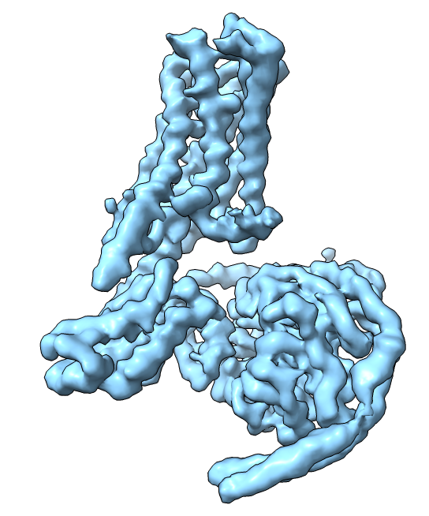 | 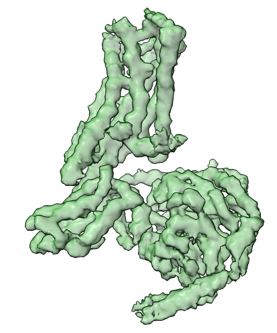 |   
| 216,884 Particles   | 27,681 Particles  |
| Filename: class_1_rec.mrc   | Filename: class_2_rec.mrc  |
| 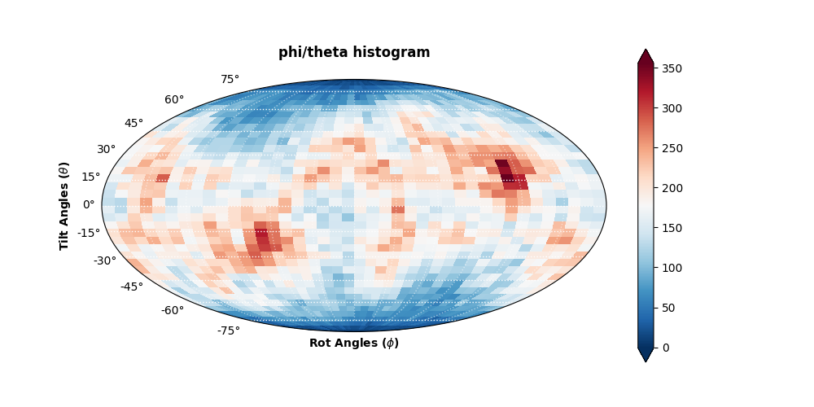 | 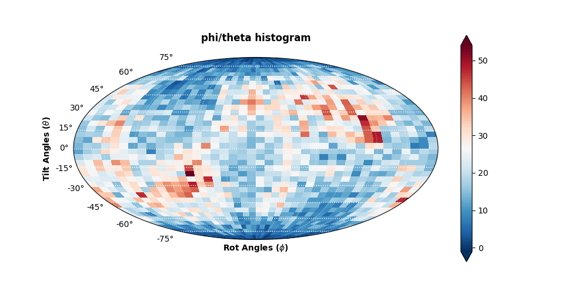 |   
| class1 euler histogram   | class2 euler histogram  |


where the number of particles is retrieved with the command 
```
janas_app_starProcess --i class_2.star --info
```
And the euler angle distribution can be obtained with another janas command:
```
janas eulerHist --i class_1.star
janas eulerHist --i class_2.star
```

Sharpened maps and details make clear those small variations within the two maps, that were not visible by comparing the two initial maps used as reference:
That looks like this:
| class1_autobfac                              | class_2_rec.mrc                           | Overlapped                           | 
|:--------------------------------------:|:--------------------------------------:|:--------------------------------------:|
| 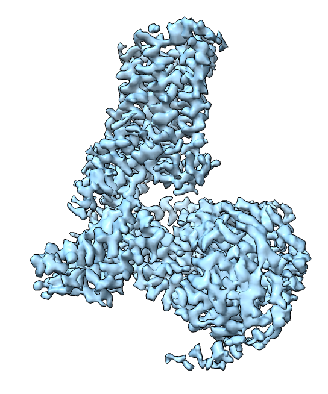 | 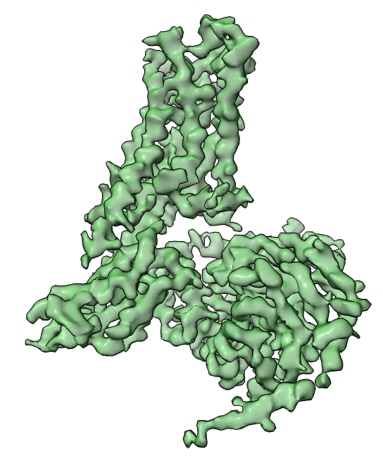 |   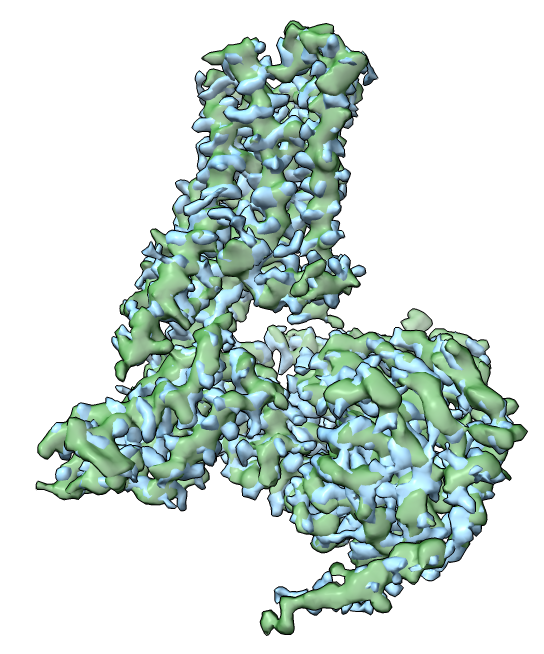 | 
| 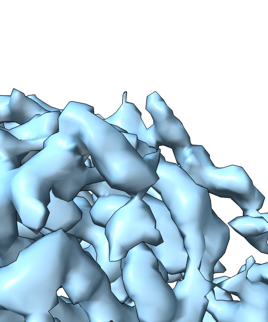 | 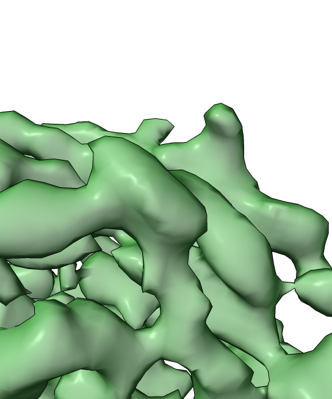 |   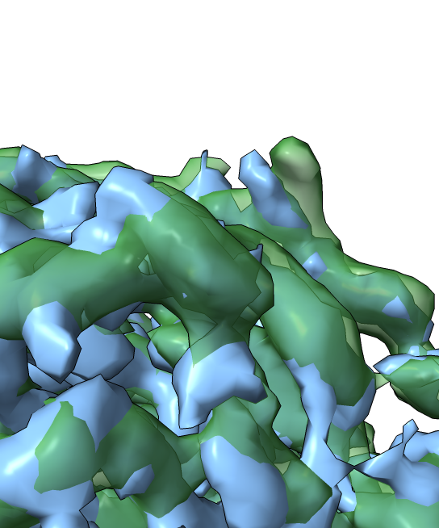 | 
| 216,884 Particles   | 27,681 Particles  ||


## Particle selection

After class reassignment, each class-specific stack still contains particles whose contribution
 may degrade local map quality. JANAS’s particle selection step systematically ranks particles 
 by their SCI score and angular coverage, then determines an optimal cutoff by sampling subsets 
 that maximise mean local resolution within a defined mask. In practice, you navigate to your 
 final_classes directory, link or copy in the raw MRCs, and launch the selection session with 
 appropriate σ, Euler-sphere partitioning and reconstruction parameters. 
 The resulting sub-stack excludes particles that do not improve map fidelity, yielding a more 
 homogeneous and higher-resolution reconstruction of your chosen conformational state.

So, go in the final_classes directory:

```
cd demo_JANAS_0.1.3/final_classes
```
and setup the JANAS session for particle selection for that classes you are interested.
So, similarly as above, create the session with the options:
```
janas_session_manager new_select_session \
    --name class1_selection \
    --particles class_1.star \
    --map class_1_recH1.mrc \
    --map2 class_1_recH2.mrc \
    --mask ../../maskFull_dilatedClose.mrc \
    --sigma 1 \
    --mpi 85 --bootstrap \
    --noExternalPrograms --gpu 0 1 \
    --numRecs 12 --maxSelections 14
```
this will create a configuration file, and a script to run class reassignment:
```
class1_selection/
├── class1_selection_run.sh
└── session_settings.toml
```
Before running JANAS selection, be sure that you have in that directory all you need.
Expecially, you want to have the raw particles to be there, In this specific case you can add it by using a symbolic link, eg.
```
ln -s ../../reference_Refined_stack.mrcs
```
once you are happy with all the parameters (you can directly change the script class1_selection_run.sh or the session_settings.toml parameters)
you just run the script
```
./class1_selection/class1_selection_run.sh
```
at the end of execution, you will find your target star file here: `./class1_selection/reference_subset.star`
that links to the selected particles in the stack `reference_Refined_stack.mrcs`.

An overview of the the processing can be found in the file `./class1_selection/overview.txt`

if you prefer a graphical view of it, you can have a summary using the janas command
```
janas_optimizer plotOverview --overview class1_selection/overview.txt --plot
```

For class2 the procedure is almost identical:
```
janas_session_manager new_select_session \
    --name class2_selection \
    --particles class_2.star \
    --map class_2_recH1.mrc \
    --map2 class_2_recH2.mrc \
    --mask ../../maskFull_dilatedClose.mrc \
    --sigma 1 \
    --mpi 85 --bootstrap \
    --noExternalPrograms --gpu 0 1 \
    --numRecs 12 --maxSelections 14
./class2_selection/class2_selection_run.sh
```